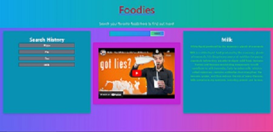

# Food Search

## Description

Our motivation for this project was to get an app working with both YouTube and Wikipedia apis. The plan is for the user to be able to look up their favorite foods and have a video and short description of said search. We built this app because it functioned the best with the apis we were using. We learned how implement multiple apis without them clashing, and how to use tailwind.

## Installation

The app is relatively simple, just search the food you want to find out more about! 

There are some known issues, like needing to reload on launch if you want to clear your saved data and the occasional video being blocked by copyright or age restrictions.

## Usage

Deployment: https://sethleininger.github.io/FoodSearch/

  

## Credits

Seth Leininger: https://github.com/sethleininger

Patrick Muth: https://github.com/Patrick-Muth

Anthony Perez: https://github.com/Anthony-A-Perez

Alex Marriott: https://github.com/AlexDCP
